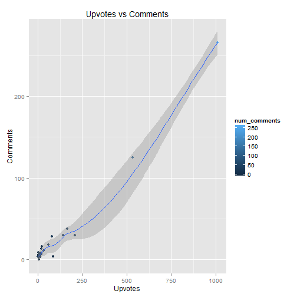

## Shiny Reddit
### A subreddit analyzer 

---

## Why?
Have you ever been reading Reddit and wondered, "Hmm, I wonder if there is a correlation between upvotes and comments on particular subreddits." Of course you have. And that's why we've created the ultra-stupendous, fantastic, mind-bending Shiny Reddit Analyser. 

--- 

## What?
With the Shiny Reddit Analyser, you can type in any subreddit and find out the total number of comments, upvotes and the correlation between comments and upvotes. But that's nota all. Act now and we'll throw in a chart mapping upvotes to comments. 

"You can see the data!" - Clark Obvious (A satisfied customer)

---

## How?
We've combined the awesomeness of Shiny Server with the latest in JavaScript Object Notation to create a powerful application that is faster than a speeding bullet and more powerful than a locomotive. If it had legs, it would jump buildings in single bounds. 

---

## Example
<!-- html table generated in R 3.1.1 by xtable 1.7-4 package -->
<!-- Sun Nov 23 11:27:56 2014 -->
<table border=1>
<caption align="bottom"> Data </caption>
<tr> <th>  </th> <th> Field </th> <th> Value </th>  </tr>
  <tr> <td align="right"> 1 </td> <td> Comments </td> <td align="right"> 656.00 </td> </tr>
  <tr> <td align="right"> 2 </td> <td> Upvotes </td> <td align="right"> 2498.00 </td> </tr>
  <tr> <td align="right"> 3 </td> <td> Correlation </td> <td align="right"> 0.99 </td> </tr>
   </table>
 

